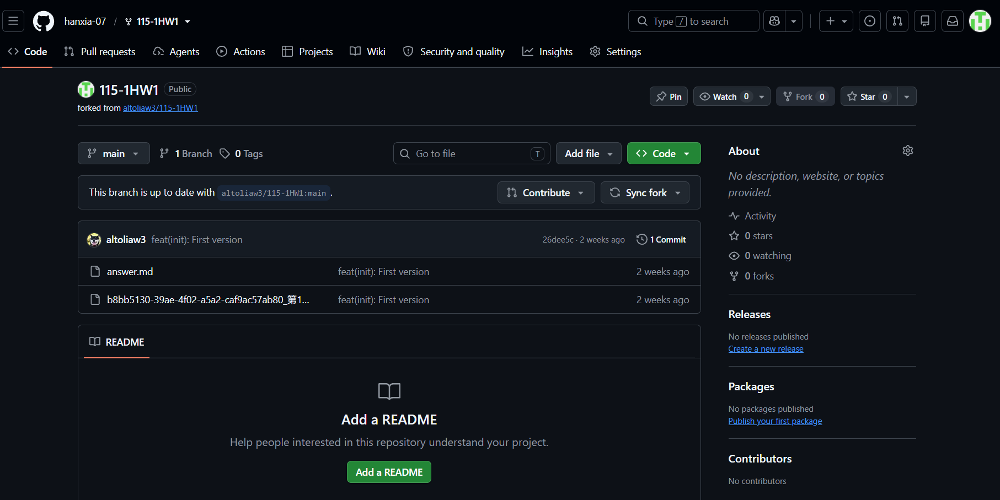
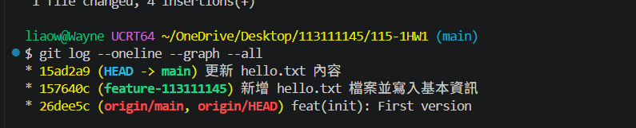
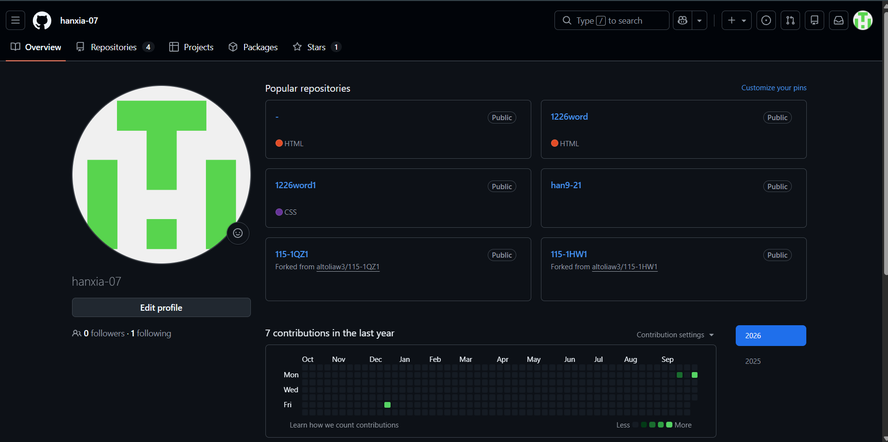

# 第1次作業題目-隨堂-HW1

>
>學號：113111145
><br />
>姓名：廖峯緯
><br />
>作業撰寫時間：80 (mins，包含程式撰寫時間)
><br />
>最後撰寫文件日期：2026/10/08
>

本份文件包含以下主題：
- [x] 說明內容
- [x] 其他 (可以包含心得或是想跟老師反映)

## 說明內容

### 1. 完成 GitHub 倉庫 Fork 說明

**操作步驟說明：**
1. 開啟瀏覽器進入老師於 GitHub 上的作業倉庫頁面。
2. 點選頁面右上角的 `Fork` 按鈕。
3. 在彈出的設定畫面中，確認將 Owner 指定為自己的 GitHub 帳號，並維持倉庫名稱不變。
4. 點選 `Create fork` 即可成功將專案複製一份至自己的遠端倉庫下。



---

### 2. Markdown 基本寫作語法介紹與範例

Markdown 是一種輕量級標記語言，常用於撰寫專案說明文件（如 README.md）。以下介紹幾種常見的語法：

1. **標題 (Headers)**
   - 語法：使用 `#` 到 `######` 表示一級到六級標題。
   - 範例：
     ```markdown
     # 一級標題
     ## 二級標題
     ### 三級標題
     ```

2. **粗體與斜體 (Emphasis)**
   - 語法：使用 `**文字**` 表示粗體，`*文字*` 表示斜體。
   - 範例：`**這是粗體文字**`，`*這是斜體文字*`

3. **清單 (Lists)**
   - 語法：無序清單使用 `-` 或 `*`；有序清單使用數字加點 `1.`。
   - 範例：
     ```markdown
     - 項目一
     - 項目二

     1. 第一步
     2. 第二步
     ```

4. **程式碼區塊 (Code Blocks)**
   - 語法：使用三個反引號包裹，並可指定程式語言進行語法高亮。
   - 範例：
     ```python
     def hello_world():
         print("Hello, Git!")
     ```

5. **超連結與圖片 (Links & Images)**
   - 語法：連結為 `[顯示文字](網址)`；圖片為 ``。
   - 範例：
     ```markdown
     [GitHub 官網](https://github.com)
     
     ```

---

### 3. Git 分支操作與 Git Graph 說明

**操作步驟與指令紀錄：**

1. **建立新分支並切換：**
   使用 `git checkout -b` 建立名稱為 `feature-113111145` 的分支並切換過去：
   ```bash
   git checkout -b feature-113111145


---

### 4. GitHub 個人 Profile 網址設定與截圖:


---

### 其他.
**心得：**
本次作業完整練習了 Git 的標準版控流程（Fork、Clone、Branch、Commit、Merge 與 Push），並學習運用 Markdown 語法撰寫文件。過程中雖然遇到了目錄路徑與存檔的小插曲，但透過終端機指令與 VSCode 介面的互相比對，對版本控制有更深刻的認識。
